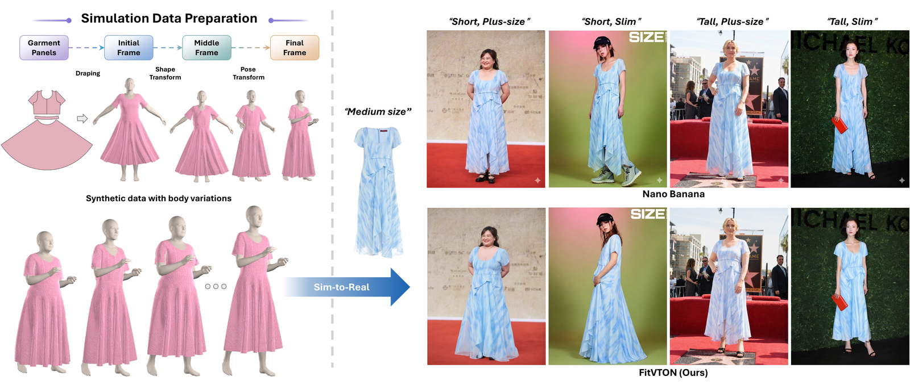

# FitVTON: Fit-aware Virtual Try-On via Body-Garment Size Control

[Yiqun Ning](https://github.com/ZenoNing), [Ao Shen](https://github.com/Shenao-code), [Chenhang He](https://github.com/skyhehe123)<sup>&dagger;</sup>, [Lei Zhang](https://www4.comp.polyu.edu.hk/~cslzhang/)

<sub><em>&dagger; Corresponding author</em></sub>

[](https://arxiv.org/abs/2606.12012)
[](https://zenoning.github.io/FitVTON/)
[](https://huggingface.co/datasets/ZenoNing/GarmentCodeVTONDataset)
[](https://huggingface.co/datasets/ZenoNing/FittingEffectDataset)

FitVTON is a fit-aware virtual try-on model that generates authentic garment fitting effects across diverse body shapes. It represents garment-body size with structured text prompts, e.g. *"long-length upper garment"* on a *"slim, medium-tall body"*, and learns fitting behavior from physically simulated try-on triplets.



*With garment-body size prompts, commercial editing models produce "neutral fit" results across different body shapes. FitVTON produces faithful fit: zoom in to see how hem position, tightness, and cuff elasticity vary across bodies.*

## Highlights

- **Simulation data pipeline.** GarmentCodeVTON: 78K aligned triplets from GarmentCode + Warp XPBD.
- **Fit-aware flow-matching.** FLUX.1 Kontext with dual LoRA adapters: text controls fit geometry, image handles garment transfer.
- **Dual-branch mask supervision.** Training-only U-Net heads on garment/body masks; mask-free at inference.
- **Texture rectification.** Stage II updates image LoRA on VITON-HD / DressCode pseudo-triplets while keeping the text LoRA frozen.
- **FittingEffect3K.** Real-world benchmark with fit-oriented VLM scoring and human preference evaluation.

## Documentation

| Topic | Details |
|-------|---------|
| Environment setup, CUDA hooks, Warp build | [`docs/setup.md`](docs/setup.md) |
| Paths, datasets, checkpoints, custom storage | [`docs/configuration.md`](docs/configuration.md) |
| Inference commands and benchmark generation | [`docs/inference.md`](docs/inference.md) |
| Stage I / Stage II training | [`docs/training.md`](docs/training.md) |
| FittingEffect3K and VLM fit evaluation | [`docs/evaluation.md`](docs/evaluation.md) |
| Regenerating GarmentCodeVTON locally | [`docs/garmentcodev2.md`](docs/garmentcodev2.md) |

## Repository Map

| Component | Entry point |
|-----------|-------------|
| Single-sample fit-prompt inference | `inference_demo.py` |
| FittingEffect3K inference | `inference_fittingeffect.py` / `scripts/run_fittingeffect_eval.sh` |
| Fit-oriented VLM evaluation | `vlm_fit_eval.py` |
| Stage I fitting LoRA | `train_fitting_lora.py` / `scripts/train_stage1.sh` |
| Mask heads | `train_maskhead.py` |
| Stage II pseudo generation | `generate_pseudo_images.py` / `scripts/generate_pseudo_images.sh` |
| Stage II texture LoRA | `train_texture_lora.py` / `scripts/train_stage2.sh` |
| GarmentCodeV2 simulation | `GarmentCodeV2/` |
| Runtime configuration | `system.json` / `system_config.py` |

## Quick Start

Run all commands from the `FitVTON/` directory.

```bash
git clone https://github.com/ZenoNing/FitVTON.git
cd FitVTON
conda env create -f environment.yml
bash conda-hooks/install.sh flux
conda activate flux
python -m pip install pyrender==0.1.45 --no-deps
```

Download the released weights and datasets:

```bash
pip install -U huggingface_hub

# Pretrained LoRA weights
hf download ZenoNing/FitVTON checkpoints --local-dir .

# Stage I training data
hf download ZenoNing/GarmentCodeVTONDataset \
  --repo-type dataset \
  --local-dir GarmentCodeVTON

# Fit-oriented benchmark
hf download ZenoNing/FittingEffectDataset \
  --repo-type dataset \
  --local-dir FittingEffectDataset
```

Configure paths in `system.json`:

```json
{
  "datasets": {
    "garmentcode_root": "GarmentCodeVTON",
    "fittingeffect_root": "FittingEffectDataset",
    "dresscode_root": "../DressCodeDataset",
    "viton_root": "../VITONDataset"
  },
  "checkpoints": {
    "root": "checkpoints"
  }
}
```

Datasets and checkpoints can live anywhere. Use absolute paths such as `/data/vton/FittingEffectDataset` in `system.json`, or relative paths resolved from the `FitVTON/` directory. See [`docs/configuration.md`](docs/configuration.md) for layouts and custom storage examples.

## Common Commands

Single-sample inference:

```bash
python inference_demo.py \
  --person_image /path/to/person.jpg \
  --reference_image /path/to/garment.jpg \
  --gender female --shape slim --height medium-tall \
  --length short-length --garment_type upper --style untucked
```

FittingEffect3K benchmark generation:

```bash
bash scripts/run_fittingeffect_eval.sh
```

Fit-oriented VLM scoring:

```bash
python vlm_fit_eval.py
```

Training:

```bash
bash scripts/train_stage1.sh
bash scripts/generate_pseudo_images.sh
bash scripts/train_stage2.sh
```

## Results

Fit-oriented protocol on FittingEffect3K (VLM-scored, 1-5; category averages across GB / T/L / SC / LF). **Whole Avg** is the unweighted mean of the upper, lower, and dress category averages.

<div align="center">

| Method | Upper Avg | Lower Avg | Dress Avg | Whole Avg |
|:------:|:---------:|:---------:|:---------:|:---------:|
| CatVTON | 2.62 | 2.09 | 1.95 | 2.30 |
| OmniTry | 3.00 | 2.15 | 2.40 | 2.55 |
| Any2AnyTryOn | 2.92 | 2.47 | 1.79 | 2.57 |
| JCo-MVTON | 2.96 | 2.71 | 2.15 | 2.74 |
| Nano Banana | 3.19 | 2.45 | 2.83 | 2.82 |
| **FitVTON** | **3.22** | **2.99** | **2.90** | **3.08** |

</div>

Human preference study on FittingEffect3K (20 participants, 100 cases, 2,000 selections):

<div align="center">

| Method | Selections ↑ | Ratio ↑ |
|:------:|:------------:|:-------:|
| **FitVTON** | **666** | **33.30%** |
| Nano Banana | 517 | 25.85% |
| JCo-MVTON | 421 | 21.05% |
| OmniTry | 163 | 8.15% |
| Any2AnyTryOn | 147 | 7.35% |
| CatVTON | 86 | 4.30% |

</div>

## License

This repository is **not** under a single license. GarmentCode / pygarment (`GarmentCodeV2/`) is MIT licensed. The NVIDIA Warp fork (`NvidiaWarp-GarmentCode/`) is under NVSCL and may only be used non-commercially under NVSCL Section 3.3. SMPL/SMPL-X model files are subject to their own licenses and are not redistributed with this repo.

## Limitations

Garment-Body Size control is derived from 16 representative body-size prototypes. This captures broad fit variations across body categories, but the control granularity is coarse: continuous body measurements, garment dimensions, and centimeter-level ease cannot yet be specified.
