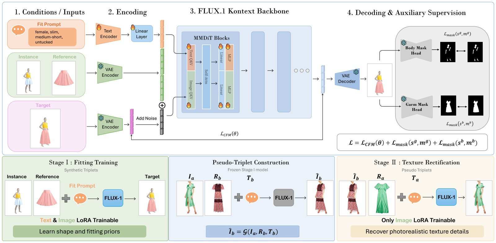

# FitVTON: Fit-aware Virtual Try-On via Body-Garment Size Control

[Yiqun Ning](https://github.com/ZenoNing), [Ao Shen](https://github.com/Shenao-code), [Chenhang He](https://github.com/skyhehe123)<sup>&dagger;</sup>, [Lei Zhang](https://www4.comp.polyu.edu.hk/~cslzhang/)

<sub><em>&dagger; Corresponding author</em></sub>

FitVTON is a fit-aware virtual try-on model that generates authentic garment fitting effects across diverse body shapes. FitVTON encodes garment-body size as structured text prompts (e.g., *"long-length upper garment"* on a *"slim, medium-tall body"*) and learns fitting dynamics from physically simulated try-on triplets.


*With garment-body size prompts, commercial editing models produce "neutral fit" results across different body shapes. FitVTON produces faithful fit: zoom in to see how hem position, tightness, and cuff elasticity vary across bodies.*

## Highlights

- **Simulation data pipeline.** GarmentCodeVTON: 78K aligned triplets from GarmentCode + Warp XPBD (19 garments × 16 bodies × 10 poses; one-piece / tucked-in / untucked).
- **Fit-aware flow-matching.** FLUX.1 Kontext with dual LoRA adapters: text controls fit geometry, image handles garment transfer.
- **Dual-branch mask supervision.** Training-only U-Net heads on garment/body masks; mask-free at inference.
- **Texture rectification.** Stage II updates image LoRA on VITON-HD / DressCode pseudo-triplets; text LoRA frozen.
- **FittingEffect3K.** Real-world benchmark (3,350 triplets) with VLM fit scoring aligned with human preference.

## Method Overview



**Top:** Person + garment + Garment-Body Size prompt → fit-aware try-on via FLUX.1 Kontext with dual LoRA adapters and dual-branch mask supervision.

**Bottom:** Stage I fits on simulation triplets; Stage II rectifies textures on real images with the image LoRA only.

This repo maps the paper's pipeline onto the following entry points:

| Paper component | Code |
|------|------|
| Stage I: fitting LoRA on GarmentCodeVTON | `train_fitting_lora.py` / `scripts/train_stage1.sh` |
| Dual-branch mask heads (training-only) | `train_maskhead.py` (invoked by `scripts/train_stage1.sh`) |
| Pseudo-triplet generation for Stage II | `generate_pseudo_images.py` / `scripts/generate_pseudo_images.sh` |
| Stage II: texture rectification LoRA | `train_texture_lora.py` / `scripts/train_stage2.sh` |
| Single-sample fit-prompt inference | `inference_demo.py` |
| FittingEffect3K evaluation | `inference_fittingeffect.py` / `scripts/run_fittingeffect_eval.sh` |
| VITON-HD / DressCode benchmark inference | `inference_benchmark_testset.py` |
| Datasets (GarmentCodeVTON, DressCode pseudo pairs, VITON) | `dataset.py` |
| Custom multi-image Kontext pipeline | `pipeline_flux_kontext_multiple_images.py` |
| Garment pattern + simulation data generation | `GarmentCodeV2/` (e.g., `multi_cloth_batch_vton.py`) |
| XPBD cloth simulation backend (NVIDIA Warp fork) | `NvidiaWarp-GarmentCode/` |

## Results

Fit-oriented protocol on FittingEffect3K (GPT-scored, 1–5; category averages across GB / T/L / SC / LF):

<div align="center">

| Method | Upper Avg | Lower Avg | Dress Avg | Whole Avg |
|:------:|:---------:|:---------:|:---------:|:---------:|
| CatVTON | 2.62 | 2.09 | 1.95 | 2.30 |
| OmniTry | 3.00 | 2.15 | 2.40 | 2.55 |
| Any2AnyTryOn | 2.92 | 2.47 | 1.79 | 2.57 |
| JCo-MVTON | 2.96 | 2.71 | 2.15 | 2.74 |
| Nano Banana | 3.19 | 2.45 | 2.83 | 2.82 |
| **FitVTON** | **3.22** | **2.99** | **2.90** | **3.08** |

</div>

Human preference study on FittingEffect3K (20 participants, 100 cases, 2,000 selections; best fit vs. ground truth):

<div align="center">

| Method | Selections ↑ | Ratio ↑ |
|:------:|:------------:|:-------:|
| **FitVTON** | **666** | **33.30%** |
| Nano Banana | 517 | 25.85% |
| JCo-MVTON | 421 | 21.05% |
| OmniTry | 163 | 8.15% |
| Any2AnyTryOn | 147 | 7.35% |
| CatVTON | 86 | 4.30% |

</div>

## Repository Layout

```
FitVTON/
├── system.json                  # User-editable path configuration
├── system_config.py             # Config loader with built-in defaults
├── dataset.py                   # GarmentCodeVTON / DressCode / VITON datasets
├── train_fitting_lora.py        # Stage I fitting LoRA trainer
├── train_maskhead.py            # Dual-branch mask head trainer
├── train_texture_lora.py        # Stage II texture LoRA trainer
├── generate_pseudo_images.py    # Stage II pseudo-triplet generation
├── inference_demo.py            # Single-sample inference
├── inference_fittingeffect.py   # FittingEffect3K batch inference
├── inference_benchmark_testset.py # VITON-HD / DressCode benchmarks
├── pipeline_flux_kontext_multiple_images.py
├── scripts/                     # Shell entry points
│   ├── train_stage1.sh
│   ├── generate_pseudo_images.sh
│   ├── train_stage2.sh
│   └── run_fittingeffect_eval.sh
├── GarmentCodeV2/               # Garment patterns + simulation data pipeline
│   ├── multi_cloth_batch_vton.py    # Main batch simulator
│   ├── multi_cloth_ref_vton.py      # Reference garment renders
│   ├── multi_cloth_demo_frames.py   # Optional frame demos
│   ├── scripts/                     # body_sequence_utils, garment_spec_utils
│   ├── assets/newcloth/             # Garment specification JSONs
│   ├── human_model_files/           # SMPL/SMPL-X weights (download separately)
│   └── system.json                  # GarmentCodeV2 path config
├── NvidiaWarp-GarmentCode/      # NVIDIA Warp fork (XPBD cloth simulation)
├── checkpoints/                 # Pretrained LoRA weights (download from HF, not in git)
├── pseudo.txt / second.txt      # Stage II pair lists
└── environment.yml / conda-hooks/
```

Clone the repository, then run all commands from the `FitVTON/` directory:

```bash
git clone https://github.com/ZenoNing/FitVTON.git
cd FitVTON
```

## Workflow

End-to-end path from clone to FittingEffect3K evaluation. **Weights and datasets are published on Hugging Face** — download them directly instead of re-running the GarmentCodeV2 simulator unless you need to regenerate data.

| Asset | Hugging Face | Used for |
|-------|--------------|----------|
| Pretrained LoRA weights | [ZenoNing/FitVTON](https://huggingface.co/ZenoNing/FitVTON) | Inference and as Stage II starting point |
| GarmentCodeVTON | [ZenoNing/GarmentCodeVTONDataset](https://huggingface.co/datasets/ZenoNing/GarmentCodeVTONDataset) | Stage I fitting LoRA + mask heads |
| FittingEffect3K | [ZenoNing/FittingEffectDataset](https://huggingface.co/datasets/ZenoNing/FittingEffectDataset) | Fit-oriented benchmark evaluation |

```
Clone repo → env (flux) → download weights + datasets → edit system.json → inference / eval
                                              └→ (optional) Stage I → Stage II retraining
```

### 1. Environment

Create and verify the `flux` conda environment ([details](#environment-setup)):

```bash
conda env create -f environment.yml
bash conda-hooks/install.sh flux
conda activate flux
# install pyrender, patch diffusers pipeline, build NvidiaWarp-GarmentCode (see Environment Setup)
```

### 2. Download weights and datasets

Install the Hugging Face CLI if needed (`pip install -U huggingface_hub`), then download assets into the repo tree:

```bash
# Pretrained LoRA weights (required for inference; optional starting point for Stage II)
hf download ZenoNing/FitVTON checkpoints --local-dir .

# GarmentCodeVTON — simulation try-on triplets for Stage I training
hf download ZenoNing/GarmentCodeVTONDataset \
  --repo-type dataset \
  --local-dir GarmentCodeVTON

# FittingEffect3K — real-world fit evaluation benchmark
hf download ZenoNing/FittingEffectDataset \
  --repo-type dataset \
  --local-dir FittingEffectDataset
```

After download, confirm the layouts:

- `checkpoints/` contains `default_lora_weights.safetensors` and `texture_lora_weights.safetensors`
- `GarmentCodeVTON/` contains `Ref/`, `female/`, and `male/` (see [GarmentCodeVTON layout](#output-layout-garmentcodevton))
- `FittingEffectDataset/` contains `tryon_triples_all.csv`, `female/`, and `male/` (see [FittingEffect3K](#fittingeffect3k))

If a repo is gated, log in first: `hf auth login`.

### 3. Configure paths

Edit `system.json` at the repo root (empty fields fall back to `system_config.py` defaults):

```json
{
  "datasets": {
    "garmentcode_root": "GarmentCodeVTON",
    "fittingeffect_root": "FittingEffectDataset",
    "dresscode_root": "../DressCodeDataset",
    "viton_root": "../VITONDataset"
  },
  "checkpoints": {
    "root": "checkpoints"
  }
}
```

Stage II still needs DressCode and/or VITON-HD on disk for pseudo-triplet generation and texture rectification; only GarmentCodeVTON and FittingEffect3K are hosted on Hugging Face.

### 4. Stage I — fitting LoRA

```bash
conda activate flux
bash scripts/train_stage1.sh
```

Trains on `datasets.garmentcode_root` with the six-stage curriculum. Mask heads train automatically when missing.

### 5. Stage II — texture rectification

```bash
bash scripts/generate_pseudo_images.sh   # uses pseudo.txt + DressCode/VITON
bash scripts/train_stage2.sh             # uses second.txt + pseudo outputs
```

### 6. Inference and evaluation

```bash
# Single-sample demo with Garment-Body Size prompts
python inference_demo.py --person_image ... --reference_image ... \
  --gender female --shape slim --height medium-tall \
  --length short-length --garment_type upper --style untucked

# FittingEffect3K benchmark (uses datasets.fittingeffect_root)
bash scripts/run_fittingeffect_eval.sh

# DressCode / VITON-HD benchmarks
python inference_benchmark_testset.py --dataset dresscode
```

### Optional — regenerate GarmentCodeVTON locally

To reproduce or extend the simulation dataset instead of using the Hugging Face release, install [SMPL / SMPL-X body models](#smpl--smpl-x-body-models), then follow [GarmentCodeV2 (Simulation Data)](#garmentcodev2-simulation-data) and point `datasets.garmentcode_root` at the generated `dataset_root`.

> **Note:** Training and evaluation on the Hugging Face datasets do **not** require SMPL or SMPL-X. They are only needed when running the GarmentCodeV2 simulation pipeline locally.

## Environment Setup

This repo ships reproducible conda environment files and CUDA activation hooks.

| Path | Purpose |
|------|---------|
| `environment.yml` | Main stack: torch 2.11 + cu126 + CUDA toolkit 12.6 for FLUX training/inference and GarmentCode simulation |
| `pipeline_flux_kontext_multiple_images.py` | Local copy of the custom Flux Kontext pipeline used by training/inference scripts |
| `conda-hooks/` | Conda activate/deactivate scripts so `nvcc` and `CUDA_HOME` point to the env CUDA toolkit |
| `conda-hooks/install.sh` | Installs hooks into an existing conda env |

### Create the main environment (`flux`)

```bash
conda env create -f environment.yml
bash conda-hooks/install.sh flux
conda activate flux
python -m pip install pyrender==0.1.45 --no-deps
python - <<'PY'
from pathlib import Path
import shutil, diffusers
src = Path("pipeline_flux_kontext_multiple_images.py").resolve()
dst = Path(diffusers.__file__).resolve().parent / "pipelines/flux/pipeline_flux_kontext_multiple_images.py"
shutil.copy2(src, dst)
print(dst)
PY
```

This is the main environment for FLUX training/inference and GarmentCode simulation together.

After creating a new training env, rebuild the local Warp fork inside that env. Do not reuse Warp binaries compiled in another env.

Before launching training:

- Install conda CUDA hooks: `bash conda-hooks/install.sh flux`
- Copy `pipeline_flux_kontext_multiple_images.py` into the active env's diffusers package
- Do not export system CUDA inside the env; rely on `$CONDA_PREFIX`
- Mask-head weights are reused automatically when present; mask-head training is skipped otherwise

### Why the conda hooks are needed

If the host shell exports system CUDA globally, e.g.:

```bash
export PATH="/usr/local/cuda-12.6/bin:$PATH"
export CUDA_HOME="/usr/local/cuda-12.6"
```

then `conda activate` alone may still leave `nvcc` pointing at the system toolkit instead of the env toolkit.

The hooks in `conda-hooks/` fix this on activate by setting `CUDA_HOME=$CONDA_PREFIX`, `CUDA_PATH=$CONDA_PREFIX`, and prepending `$CONDA_PREFIX/bin` to `PATH`.

Recommended `~/.bashrc` snippet so system CUDA is only used when no conda env is active:

```bash
if [ -z "${CONDA_PREFIX:-}" ]; then
  export PATH="/usr/local/cuda-12.6/bin:$PATH"
  export LD_LIBRARY_PATH="/usr/local/cuda-12.6/lib64:${LD_LIBRARY_PATH:-}"
  export CUDA_HOME="/usr/local/cuda-12.6"
  export CUDA_PATH="/usr/local/cuda-12.6"
fi
```

### Verify CUDA inside an env

```bash
conda activate flux
echo "$CUDA_HOME"
which nvcc
nvcc --version
python -c "import torch; print(torch.__version__, torch.cuda.is_available(), torch.version.cuda)"
```

Expected for `flux`:

- `CUDA_HOME` = `$CONDA_PREFIX`
- `nvcc --version` = 12.6

### If activate prints `grep/tr/sed: command not found`

Your current shell `PATH` is broken. Reset it, then re-activate:

```bash
export PATH=/usr/local/sbin:/usr/local/bin:/usr/sbin:/usr/bin:/sbin:/bin
conda deactivate
conda activate flux
```

Opening a fresh terminal is usually easier.

### Build Warp in the active env

The simulation data pipeline uses the bundled NVIDIA Warp fork (`NvidiaWarp-GarmentCode/`) for XPBD cloth simulation. Build it inside `flux` after the env and CUDA hooks are ready.

```bash
conda activate flux
cd NvidiaWarp-GarmentCode

TARGETS="$CONDA_PREFIX/targets/x86_64-linux"
TARGETS_INCLUDE="$TARGETS/include"
TARGETS_LIB="$TARGETS/lib"

ln -sfn "$CONDA_PREFIX/lib" "$CONDA_PREFIX/lib64"

for item in "$TARGETS_INCLUDE"/*; do
  base=$(basename "$item")
  if [ ! -e "$CONDA_PREFIX/include/$base" ]; then
    ln -sfn "$item" "$CONDA_PREFIX/include/$base"
  fi
done
for lib in "$TARGETS_LIB"/*static*.a; do
  ln -sfn "$lib" "$CONDA_PREFIX/lib64/$(basename "$lib")"
done

python build_lib.py
python -m pip install -e .
```

Verify:

```bash
python - <<'PY'
import warp as wp
wp.init()
print(wp.__file__)
print(wp.get_device("cuda:0") if wp.is_cuda_available() else "cpu only")
PY
```

## Configuration

Edit `system.json` after cloning. Empty path fields fall back to built-in defaults in `system_config.py` until you set them. Relative paths are resolved from the `FitVTON/` directory.

Recommended values:

| Key | Recommended value | Used for |
|-----|-------------------|----------|
| `datasets.garmentcode_root` | `GarmentCodeVTON` | Stage I simulation triplets ([HF download](https://huggingface.co/datasets/ZenoNing/GarmentCodeVTONDataset)) |
| `datasets.dresscode_root` | `../DressCodeDataset` | Stage II rectification + benchmarks |
| `datasets.viton_root` | `../VITONDataset` | Benchmarks |
| `datasets.fittingeffect_root` | `FittingEffectDataset` | FittingEffect3K evaluation ([HF download](https://huggingface.co/datasets/ZenoNing/FittingEffectDataset)) |
| `checkpoints.root` | `checkpoints` | Pretrained LoRA weights ([HF download](https://huggingface.co/ZenoNing/FitVTON)) |
| `outputs.pseudo_images` | `pseudo_images` | Stage II pseudo targets |
| `outputs.fitting_lora` | `outputs/fitting_lora` | Stage I training output |
| `outputs.texture_lora` | `outputs/texture_lora` | Stage II training output |
| `outputs.maskhead` | `outputs/maskhead` | Mask-head training output |
| `outputs.demo` | `outputs/demo` | Demo inference output |
| `outputs.fittingeffect` | `outputs/fittingeffect` | FittingEffect3K inference output |

Fixed repo files (not configurable in `system.json`):

- `pseudo.txt`, `second.txt` — Stage II pair lists at the repo root
- `outputs/logs/pseudo_images`, `outputs/logs/fittingeffect_eval` — shell log directories

Model IDs default to HuggingFace repos `black-forest-labs/FLUX.1-Kontext-dev` (backbone) and `zer0int/LongCLIP-KO-LITE-TypoAttack-Attn-ViT-L-14` (long-prompt CLIP text encoder). Optional local overrides: `models.flux_model_path`, `models.longclip_model_path`.

### Pretrained LoRA weights

Weights are **not** shipped in git. Download from [ZenoNing/FitVTON](https://huggingface.co/ZenoNing/FitVTON):

```bash
hf download ZenoNing/FitVTON checkpoints --local-dir .
```

This creates `checkpoints/` at the repo root with:

| File | Stage | Description |
|------|-------|-------------|
| `default_lora_weights.safetensors` | I | Fitting LoRA — geometry / fit prior |
| `texture_lora_weights.safetensors` | II | Texture LoRA — real-image rectification |

Set `checkpoints.root` to `checkpoints` in `system.json` (default). For inference and FittingEffect3K evaluation, only the download above is required — retraining (Stages I–II) is optional.

## SMPL / SMPL-X body models

GarmentCodeV2 cloth simulation drives garments on **SMPL-X** bodies and uses **SMPL** as a vertical-alignment reference. These model files are subject to separate licenses and are **not** included in this repository.

You only need them if you run the local simulation scripts under `GarmentCodeV2/` (not required when using the pre-built [GarmentCodeVTONDataset](https://huggingface.co/datasets/ZenoNing/GarmentCodeVTONDataset) from Hugging Face).

### 1. Register and download

| Model | Official site | License |
|-------|---------------|---------|
| SMPL | [smpl.is.tue.mpg.de](https://smpl.is.tue.mpg.de/) | Registration + [SMPL Model License](https://smpl.is.tue.mpg.de/modellicense) |
| SMPL-X | [smpl-x.is.tue.mpg.de](https://smpl-x.is.tue.mpg.de/) | Registration + [SMPL-X Model License](https://smpl-x.is.tue.mpg.de/modellicense) |

On each site: **Sign In / Register** → agree to the license → open **Download** → fetch the Python model archives (SMPL and SMPL-X respectively).

### 2. Place files under `GarmentCodeV2/human_model_files/`

Create the directories if they do not exist:

```bash
mkdir -p GarmentCodeV2/human_model_files/smpl
mkdir -p GarmentCodeV2/human_model_files/smplx
```

Copy the downloaded weights so the paths match `GarmentCodeV2/system.json` (`smpl_models_dir`, `smplx_models_dir`). Filenames expected by `pygarment/paths_config.py`:

**`human_model_files/smpl/`** (from [SMPL downloads](https://smpl.is.tue.mpg.de/)):

| File | Used for |
|------|----------|
| `SMPL_FEMALE.pkl` | Female body alignment reference |
| `SMPL_MALE.pkl` | Male body alignment reference |

**`human_model_files/smplx/`** (from [SMPL-X downloads](https://smpl-x.is.tue.mpg.de/)):

| File | Used for |
|------|----------|
| `SMPLX_FEMALE.npz` or `SMPLX_FEMALE.pkl` | Female simulation bodies |
| `SMPLX_MALE.npz` or `SMPLX_MALE.pkl` | Male simulation bodies |

`.npz` is preferred when both formats are available. The bundled `smpl_body_parts_2_faces.json` and `smplx_body_parts_2_faces.json` mapping files can stay in these folders.

### 3. Point `GarmentCodeV2/system.json`

```json
{
  "smpl_models_dir": "./human_model_files/smpl",
  "smplx_models_dir": "./human_model_files/smplx"
}
```

(`GarmentCodeV2/system.json` ships with these repo-relative defaults already filled in; `system.template.json` keeps a pristine reference copy.)

## GarmentCodeV2 (Simulation Data)

Stage I training reads **GarmentCodeVTON** triplets. The released dataset is on [Hugging Face](https://huggingface.co/datasets/ZenoNing/GarmentCodeVTONDataset) — see [Workflow](#workflow) for download commands. Use this section only if you want to **regenerate or extend** simulation data locally.

Build Warp in the `flux` env first (see [Build Warp in the active env](#build-warp-in-the-active-env)), then generate data before running `scripts/train_stage1.sh`.

All commands below are launched from `GarmentCodeV2/` so the local `pygarment` package is on `PYTHONPATH`:

```bash
cd GarmentCodeV2
conda activate flux
```

### Prerequisites

1. **SMPL / SMPL-X body models** — see [SMPL / SMPL-X body models](#smpl--smpl-x-body-models) ([SMPL](https://smpl.is.tue.mpg.de/), [SMPL-X](https://smpl-x.is.tue.mpg.de/)).
2. **Pose vectors** — `.npz` files under `GarmentCodeV2/smplx/` (one per pose index used by the batch script).
3. **Garment patterns** — bundled under `GarmentCodeV2/assets/newcloth/` (`*_specification.json`).

### GarmentCodeV2 configuration

Edit `GarmentCodeV2/system.json` (ships with repo-relative defaults; `system.template.json` keeps a pristine reference copy). Default values:

| Key | Recommended value | Purpose |
|-----|-------------------|---------|
| `smplx_models_dir` | `./human_model_files/smplx` | SMPL-X model files |
| `smpl_models_dir` | `./human_model_files/smpl` | SMPL model files (alignment reference) |
| `pose_dir` | `./smplx` | Pose `.npz` directory |
| `dataset_root` | `./outputs/vton_dataset` | Final GarmentCodeVTON layout (used by Stage I) |
| `demo_root` | `./outputs/vton_demo` | Frame-by-frame demo outputs |
| `cache_root` | *(via CLI `--cache-root`)* | Garment/body caches and scratch runs (default `precomputed/`) |

After generation, point FitVTON's `datasets.garmentcode_root` in `system.json` to the same directory as `GarmentCodeV2`'s `dataset_root` (e.g. `GarmentCodeV2/outputs/vton_dataset` or a copy/symlink at `../GarmentCodeVTON`).

### Pipeline overview

| Script | Role |
|--------|------|
| `multi_cloth_ref_vton.py` | Render flat **reference garment** images (`Ref/<unit>/render_*.png`) on a neutral body; body is hidden in the render |
| `multi_cloth_batch_vton.py` | Main **batch simulator**: 19 outfits × wearing modes × 16 body shapes × 10 poses × genders → try-on triplets with masks |
| `multi_cloth_demo_frames.py` | Optional **frame-by-frame** demos for visualization (single GPU, a few fixed samples) |

Shared helpers live in `GarmentCodeV2/scripts/` (`body_sequence_utils.py`, `garment_spec_utils.py`).

### Output layout (GarmentCodeVTON)

`multi_cloth_batch_vton.py` writes the layout expected by `dataset.py` / `GarmentCodeVTONDataset`:

```
<dataset_root>/
├── Ref/
│   ├── upper1/render_front.png
│   ├── pants1/render_front.png
│   └── ...
├── female/
│   └── female0/
│       └── dress1/
│           └── one_piece/
│               └── pose0/
│                   ├── render_front.png
│                   ├── garment_mask_front.png
│                   └── body_mask_front.png
└── male/
    └── ...
```

Two-piece outfits produce both `tucked_in/` and `untucked/` subfolders; dresses use `one_piece/`.

### Step 1 — Reference garments

```bash
cd GarmentCodeV2
python multi_cloth_ref_vton.py --gpus 0
```

Useful flags: `--unit-filter upper1,pants4` (subset), `--limit 2` (smoke test), `--force` (re-render), `--debug` (serial, no multiprocessing).

### Step 2 — Batch simulation (main dataset)

Full run (multi-GPU example):

```bash
python multi_cloth_batch_vton.py \
  --dataset-root ./outputs/vton_dataset \
  --cache-root ./precomputed \
  --gpus 0,1,2,3 \
  --workers-per-gpu 1
```

Smoke test (one outfit, one pose, one body):

```bash
python multi_cloth_batch_vton.py \
  --outfit-filter dress1 \
  --outfit-limit 1 \
  --pose-limit 1 \
  --num-bodies 1 \
  --genders female \
  --gpus 0
```

Other useful flags:

- `--precompute-only` — warm garment and body-sequence caches without running simulation
- `--force` — re-run even when outputs already exist
- `--alignment-reference female` — vertical alignment basis (default; keeps garment coordinates on the female GarmentCode template)

Progress is logged to `<cache-root>/batch_results.jsonl`. Intermediate caches live under `<cache-root>/garments/` and `<cache-root>/body_sequences/`.

### Step 3 — Demo frames (optional)

```bash
python multi_cloth_demo_frames.py --gpu-id 0
```

Runs two built-in samples by default. To target one triple:

```bash
python multi_cloth_demo_frames.py \
  --sample-id female__female0__dress1__one_piece__pose5 \
  --gpu-id 0
```

Outputs land under `demo_root` with per-frame PNGs in `frames/`.

### Link to FitVTON training

Set in the repo-root `system.json`:

```json
"datasets": {
  "garmentcode_root": "GarmentCodeV2/outputs/vton_dataset"
}
```

(or any path that contains the `Ref/`, `female/`, and `male/` trees above). Then proceed to Stage I below.

## Training

Training follows the paper's two-stage strategy. Activate the main env first:

```bash
conda activate flux
```

### Stage I: fitting LoRA

Trains the transformer LoRA on GarmentCodeVTON simulation triplets through a six-stage curriculum (shape-heavy dress pairs → cloth-type-balanced → wearing-style → shape-balanced → ...). Mask heads are trained automatically first when their weights are missing, then used as the dual-branch supervision during LoRA training.

```bash
bash scripts/train_stage1.sh
```

Useful environment overrides: `NUM_GPUS`, `TRAIN_BATCH_SIZE`, `CAP` (max pairs per group), `SKIP_MASK_HEAD=1`.

### Stage II: texture rectification

First generate pseudo targets with the frozen Stage I model (pairs listed in `pseudo.txt`):

```bash
bash scripts/generate_pseudo_images.sh
```

Then train the texture LoRA on pseudo-triplets mixed with real reconstruction pairs (`second.txt`), keeping the fitting LoRA frozen:

```bash
bash scripts/train_stage2.sh
```

### Smoke test

Stage I, 2 steps, 1 GPU, without the full curriculum script:

```bash
CUDA_VISIBLE_DEVICES=0 accelerate launch --num_processes 1 train_fitting_lora.py \
  --garmentcode_root /path/to/GarmentCodeVTON \
  --output_dir outputs/fitting_lora_smoke \
  --max_train_steps 2
```

## Inference

Single-sample demo with Garment-Body Size prompt control. Prompt attributes (`--gender`, `--shape`, `--height`, `--length`, `--garment_type`, `--style`) accept comma-separated values to form a grid:

```bash
python inference_demo.py \
  --person_image /path/to/person.jpg \
  --reference_image /path/to/garment.jpg \
  --gender female --shape slim --height medium-tall \
  --length short-length --garment_type upper --style untucked
```

Both LoRAs are loaded by default (fitting weight 0.8, texture weight 0.2); pass `--no_texture_lora` for the Stage I model only.

FittingEffect3K benchmark eval (multi-GPU sharded):

```bash
bash scripts/run_fittingeffect_eval.sh
```

DressCode / VITON-HD benchmark testset:

```bash
python inference_benchmark_testset.py --dataset dresscode
```

## FittingEffect3K

A real-world benchmark for fit-oriented evaluation: 3,350 triplets built from 14 medium-sized garments with measurements, 5 male and 5 female models with body measurements, in 5 poses.

Download from [ZenoNing/FittingEffectDataset](https://huggingface.co/datasets/ZenoNing/FittingEffectDataset) (see [Workflow §2](#2-download-datasets)) or place the same layout under `FittingEffectDataset/`:

```
FittingEffectDataset/
├── tryon_triples_all.csv
├── female/
│   ├── human/
│   └── cloth/
└── male/
    ├── human/
    └── cloth/
```

Set `datasets.fittingeffect_root` in `system.json`, then run `bash scripts/run_fittingeffect_eval.sh`.

The evaluation protocol scores four fit dimensions with a VLM judge — Garment-Body Alignment (GB), Tightness/Looseness (T/L), Silhouette Consistency (SC), and Local Fit Artifacts (LF) — each rated 1-5 against the real try-on reference.

## License

This repository is **not** under a single license:

| Component | License |
|-----------|---------|
| GarmentCode / pygarment (`GarmentCodeV2/`) | [`GarmentCodeV2/LICENSE`](GarmentCodeV2/LICENSE) (MIT) |
| NVIDIA Warp fork (`NvidiaWarp-GarmentCode/`) | [`NvidiaWarp-GarmentCode/LICENSE.md`](NvidiaWarp-GarmentCode/LICENSE.md) (NVSCL, **non-commercial**) |

The Warp fork may only be used non-commercially under NVSCL Section 3.3. SMPL/SMPL-X model files are subject to their own licenses and are not redistributed with this repo.

## Limitations

Garment-Body Size control is derived from 16 representative body-size prototypes. This captures broad fit variations across body categories, but the control granularity is coarse: continuous body measurements, garment dimensions, and centimeter-level ease cannot yet be specified.
